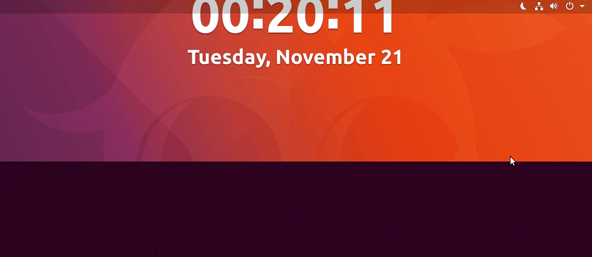

# Cron-GIU-Launcher

[**cron-gui-launcher.sh**](scripts/cron-gui-launcher.sh) is a Bash script, that is able to launch a **GUI** applications as **Cron** jobs or from a **SSH** session. The script is designed to work with the user's environment, respectively the Cron jobs shall be set within the user's `crontab`. It can be modified to work with `cron.d`, but in some cases this will cause mishmash with the file permissions within `/proc`, so it is not good idea. **Please don't modify and run the script as root. It could be harmful for the system!**

Here is a [Demo at YouTube](https://youtube.com/playlist?list=PLO24trCW6Y8evkphLwjzU_AdrznkarVS9).

[](https://youtu.be/xN2iW7Q0vTo "Click to play Video 1 on Youtube.com")
[](https://youtu.be/biC4-vQk0qs "Click to play Video 3 on Youtube.com")
[](https://youtu.be/xShzFOrZKO8 "Click to play Video 3 on Youtube.com")
<!-- https://www.sitepoint.com/youtube-video-thumbnail-urls/ -->

## Input Parameters

- `$1` - list of commands to be executed. The individual commands need to be separated with `␣&&␣` - note the spaces.

- `$2` - short description of the job that will be appended to the log file name. Read the the section *How it works?*

- `$3` - time-out in minutes, when the user is not logged in. While this variable is empty there is no time-out. If the job is on `@reboot` this variable should be empty. This option is useful for regular Cron jobs, for example: If you have a job that is executed every 15 minutes and your user is logout (or locked) for 2 hours there will have 8 pending jobs, which will be executed when the user is logged on.

## Installation

Clone the repository, by using one of the commands:

````bash
git clone git@github.com:metalevel-tech/cron-gui-launcher.git
git clone https://github.com/metalevel-tech/cron-gui-launcher.git
````

Examine and execute the script [`install.sh`](install.sh). It will create a copy of [`cron-gui-launcher.sh`](scripts/cron-gui-launcher.sh) (also [`gui-launcher.sh`](scripts/gui-launcher.sh) and [`remote_gdm3_setup.sh`](scripts/remote_gdm3_setup.sh) that will be discussed later) to **`~/bin`**, which is the preferred place to store it.

## Usage

Before creating a Cron job you can test how the scrip works from the command line. For this purpose you can open a TTY (Ctrl+Alt+F2), and try to run something in your Desktop session from that point. Or establish SHH connection to your machine from a remote host (or even you can use `ssh localhost`), and try to run something in your Desktop session from that point. The syntax is identical as the one that should be used by the Cron jobs. Example:

````bash
cron-gui-launcher.sh 'gnome-calculator' 'a short description'
````

An example Cron job:
````bash
@hourly $HOME/bin/cron-gui-launcher.sh 'gnome-calculator' 'a short description'
````

## How it works

0. Note about the logging: The script will create a log file located in `/tmp`, which name will be:

	````bash
	$USER-cron-gui-launcher-$DESCRIPTION.log
	````

   - Where as `$DESCRIPTION` will be assigned the second positional parameter `$2`, thus you can make some job's log file unique.

1. Initially the script attempts to get the current user's `$DISPLAY` number. For this purpose it uses the [following method](https://askubuntu.com/a/744751/566421):

	````bash
	w $(id -un) | awk 'NF > 7 && $2 ~ /tty[0-9]+/ {print $3; exit}'
	````
   
   - The `$DISPLAY` variable is `unset` `while` the user is not logged-in. In this case the script will `sleep` for a while and then makes a new attempt. 
   
   - This action is repeated until the `$DISPLAY` variable is set, then its value is saved and exported. 

2. Create an array of the values of the envvar `$XDG_CURRENT_DESKTOP` from each [`/proc/$ProcessNumber/environ`](http://manpages.ubuntu.com/manpages/trusty/man5/proc.5.html) file. The command `pgrep -U "$UID"` creates a list of all `$USER`'s processes. The function `get_environ()` is executed for each `$USER`'s process and its output is stored into the temporal array `XDG_CURRENT_DESKTOP+=$()`.

3. Get the name of the current Desktop Environment. [Get the most frequent value from the array](https://stackoverflow.com/questions/43440425/most-frequent-element-in-an-array-bash-3-2) created in step 2. This is the way, used here, to find the current DE when it is changed a little bit ago. The function `get_frequent()` is used here and its output is stored as value of the variable `$XDG_CURRENT_DESKTOP`.

4. Filter the value of the variable `$XDG_CURRENT_DESKTOP` and set the result as value of the trigger `$DE`.

5. Export the current `$USER`'s desktop-session environment variables. The command as `pgrep gnome-session -n -U $UID` gets the current `$USER`'s desktop-session process number, then the function `export_environ()` reads the content of `/proc/$ProcessNumber/environ` and export its content line by line.

6. Execute the list of the input commands. Fragmentation of the list of the input commands (input variable "$1"), use ` && ` as separator, then execute each one by the function `execute_input_commands()`.

## Supported/Tested Desktop Environments

```bash
$(pgrep gnome-session -n -U $UID)	# [Ubuntu Unity] [Ubuntu Gnome Desktop] [Gnome Classic | Flashbach (compis|metacity)] (Openbox) [Budgie]
$(pgrep gnome-session-b -n -U $UID) 	# - This the full name of the process!
$(pgrep budgie-daemon -n -U $UID)	# [Budgie] but $(pgrep gnome-session -n -U $UID) is better choice
$(pgrep xfce4-session -n -U $UID)	# [Xubuntu] [XFCE4]
$(pgrep mate-session -n -U $UID)	# [Ubuntu MATE] (Openbox)
$(pgrep lxsession -n -U $UID)		# [Lubuntu] [Lubuntu Netbook] [LXDE]
$(pgrep lxqt-session -n -U $UID)	# [LXQt]
$(pgrep cinnamon-session -n -U $UID)	# [Cinnamon] [Cinnamon2d] [Cinnamon (Software Rendering)]
$(pgrep startkde -n -U $UID)		# [Kubuntu] [KDE Plasma] (Openbox)
$(pgrep start-lumina-de -n -U $UID)	# [Lumina]  (The Lumina® Desktop Environment)
$(pgrep fluxbox -n -U $UID)		# [Fluxbox] (The Lumina® Desktop Environment)
$(pgrep xmonad -n -U $UID)		# [Xmonad]
$(pgrep subtle -n -U $UID)		# [Subtle]
$(pgrep awesome -n -U $UID)		# [Awesome]
$(pgrep enlightenment -n -U $UID)	# [Enlightenment]
$(pgrep i3bar -n -U $UID)		# [i3wm]
$(pgrep openbox -n -U $UID)		# [Openbox] [GNOME/Openbox KDE/Openbox]
$(pgrep starttde -n -U $UID)		# [Trinity]
```

## Simplified version
This version of the script is called just [**`gui-launcher.sh`**](scripts/gui-launcher.sh) and it is developed as an answer of the question [How can I show notify-send messages triggered by crontab?](https://askubuntu.com/a/978413/566421) at [AskUbuntu.com](https://askubuntu.com/users/566421).

In this version the automatic detection of the desktop environment (DE) is removed. So if you use DE  different than Gnome you must adapt the script according to the instructions above. The script uses an improved way for the [desktop environment export](https://askubuntu.com/q/978711/566421) which is not implemented in the original script. And simlified way to [detect does the user is logged-in](https://askubuntu.com/a/1107441/566421). Also it doesn't write a self log file. This version support only a single command as input and doesn't have timeout value.

* For other Desktop Environments change `gnome-session` in this part `$(pgrep gnome-session -n -U $UID)` with the name of the process of the DE in use, for example `mate-session`. A list of the most Ubuntu DE is [presented here](https://github.com/metalevel-tech/cron-gui-launcher#supportedtested-desktop-environments). Lubuntu implementation of the same script - [here](https://askubuntu.com/a/1019449/566421). The script could be used to launch GUI app from TTY or SSH session in the current user's Desktop session.

* The script will work until the user is logged-in, including a locked screen.

* **Please don't modify and run the script as root. It could be harmful for the system!**

Here is how it works at Ubuntu 17.10 with Wayland.

[](demo-images/gui-launcher-sh-at-ubuntu-with-wayland.gif)

**Note: the original script is capable to execute much complex commands as `gnome-session-quit --no-prompt` (<s>or `xdg-screensaver lock`</s> *it does not need DISPLAY*) while this simplified version fails, but it is useful when you want to just start an application.**

# Log-in a User into a Desktop Session from within SSH session

The script [**`remote_gdm3_setup.sh`**](scripts/remote_gdm3_setup.sh) is developed for Ubuntu 20.04 with X.Org, Gnome and GDM3. This is not the perfect solution but it helps me in some cases. Note you it uses a custom configuration file that should be created [`/etc/gdm3/custom.conf`](scripts/remote_gdm3_setup_etc-gdm3-custom.conf).

The script [`remote_gdm3_setup.sh`](scripts/remote_gdm3_setup.sh) accepts the following options:

* `login` | `log-in` | `vnc` - the current user will be logged-in into a desktop session - appropriate for VNC session.

* `logout` | `log-out` | `rdp` - the current user will be logged-out and the GDM3 settings will be changed in a way appropriate for xRDP session.

* `lock` | `lockscreen` | `lock-screen` - the current user will be logged-in into a desktop session and then the screen will be locked - appropriate for VNC session.

Here is how it works at Ubuntu 20.04.

[](demo-images/remote_gdm3_setup-demo.gif)

## References: Origins and other applications of the approach

- [How to launch any GUI related application from crontab in Ubuntu 16.04, 17.10 and other Ubuntu distributions with Gnome](https://askubuntu.com/questions/978382/how-can-i-show-notify-send-messages-triggered-by-crontab/978413#978413)

- [Cannot change desktop background with crontab on Lubuntu](https://askubuntu.com/a/1019449/566421)

- [How do I split a “/proc/*/environ” file in separate lines?](https://askubuntu.com/questions/978711/how-do-i-split-a-proc-environ-file-in-separate-lines)

- [How to determine which is the current user's DE through CLI within SSH or Cron?](https://askubuntu.com/questions/956664/how-to-determine-which-is-the-current-users-de-through-cli-within-ssh-or-cron)

- [Cron job to run python script at reboot does not work](https://askubuntu.com/questions/970771/cron-job-to-run-python-script-at-reboot-does-not-work)

- [Adjust brightness with `xrandr` and cron job](https://askubuntu.com/questions/958228/adjust-brightness-with-xrandr-and-cron-job)

- [Crontab and C program that should be executed into a terminal window](https://askubuntu.com/questions/955582/crontab-and-c-program-that-should-be-executed-into-a-terminal-window)

- [Why does this cronjob not work? (Daily-Reddit-Wallpaper)](https://askubuntu.com/questions/911570/why-does-this-cronjob-not-work)

- [How to run script files in a new terminal after connecting to Ubuntu 16.04 server via ssh?](https://askubuntu.com/a/1040852/566421)

- [How to type into the lightdm login screen from the command line?](https://askubuntu.com/a/1020804/566421)

- [Is this behavior of VLC normal?](https://askubuntu.com/a/1107441/566421)
